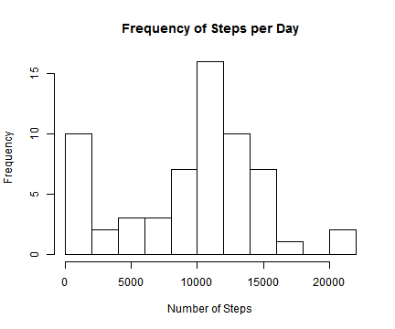
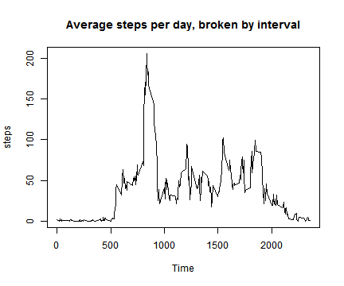
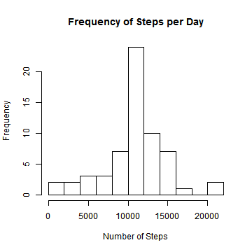
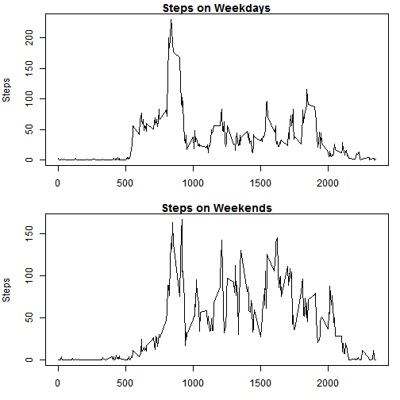

# Reproducible Research: Peer Assessment 1
## Steven Silverman

First, we have to read in the data. Be sure that activity.csv is in your working directory.


```r
activity <- read.csv("activity.csv")
```

## Summary Statistics

We create a histogram showing the frequency of total steps per day.


```r
hist(rowsum(activity$steps, activity$date, na.rm = TRUE),
     main = "Frequency of Steps per Day", xlab = "Number of Steps", breaks = 10)
```

 

We can also easily find the mean and median number of steps, again with the rowsum function:


```r
mean(rowsum(activity$steps, activity$date, na.rm = TRUE))
median(rowsum(activity$steps, activity$date, na.rm = TRUE))
```

```r
mean = 9354.23
median = 10395
```

Next, calculate the average steps on an by-interval basis, and plot the result.


```r
steps <- tapply(activity$steps, activity$interval, FUN = mean, na.rm = TRUE)
plot(levels(factor(activity$interval)), steps, type = "l", xlab = "Time",
     main = "Average steps per day, broken by interval")
```

 

The highest average steps per day occurs at 8:35 AM (roughly 206.17 steps per day). This is easily found with ``max(steps)`` and a reverse lookup.

## Missing Values

A quick call to ``complete.cases()`` gives us 15264 rows without missing values, meaning there are 2304 that are missing at least one measurement.

To correct this, we will use the mean for the 5-minute interval, calculated with only the available data. This replacement is unsophisticated, but effective.


```r
newSteps <- activity$steps
for(index in 1:nrow(activity)) {
    if (is.na(activity$steps[index])) {
        newSteps[index] = steps[rownames(steps) == activity$interval[index]]
    }
}
newActivity <- data.frame(newSteps, activity$date, activity$interval)
colnames(newActivity) <- c("newSteps", "date", "interval")
```

The resulting data frame, newActivity, contains no missing values.

The histogram looks a bit different as well:


```r
hist(rowsum(newActivity$newSteps, newActivity$date), xlab = "Number of Steps",
     main = "Frequency of Steps per Day", breaks = 10)
```

 

Adding the missing values in as means tightens up the data, narrowing the histogram. The measures of center increase as well.


```r
mean(rowsum(newActivity$newSteps, newActivity$date))
median(rowsum(newActivity$newSteps, newActivity$date))
```

```r
mean = median = 10766.19
```

## Weekdays versus Weekends

We need to create a factor variable based on the day of the week.


```r
dayWeek <- weekdays(as.Date(newActivity$date))
dayWeek <- replace(dayWeek, dayWeek %in% c("Saturday", "Sunday"), "weekend")
dayWeek <- replace(dayWeek, dayWeek %in% c("Monday", "Tuesday", "Wednesday", "Thursday", "Friday"),
                   "weekday")
dayWeek <- factor(dayWeek)
newActivity$dayWeek <- dayWeek
dayWeekSteps <- tapply(newActivity$newSteps, INDEX = list(newActivity$interval,
                       newActivity$dayWeek), FUN = mean)
```

Next we create plots to compare the two.


```r
par(mar = c(3, 4, 1.2, 1), mfrow = c(2, 1))
plot(levels(factor(activity$interval)), dayWeekSteps[,1], type = "l",
     main = "Steps on Weekdays", xlab = "Interval", ylab = "Steps")
plot(levels(factor(activity$interval)), dayWeekSteps[,2], type = "l",
     xlab = "Interval", ylab = "Steps", main = "Steps on Weekends")
```

 

It's clear that the steps are more variable on weekends, probably because there is no prolonged sitting at a desk, and also don't ramp up until later in the day (also to be expected).
